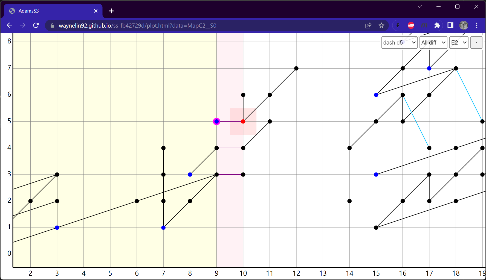

## 网址参数
现在所有的图共用一个同一个网页 `plot.html`，但可以通过传参数来决定网页加载的谱序列及行为。第一个参数前要加问号`?`，参数之间用`&`号连接。如下为示例。

* `plot.html?data=S0`: 显示S0的谱序列
* `plot.html?data=C2`: 显示C2的谱序列
* `plot.html?data=MapC2__S0`: 显示C2到S0的谱序列映射，映射格式基本都为`MapCW1__CW2`，比如可能是`MapRP1_4__RP3_4`。例外是`MapKahnPriddy`。名字具体以来源diagram里的`ss.json`为准。
* `plot.html?data=S0&x=126&y=10&scale=2`: 显示S0的谱序列, 并将degree (126, 10) 尽可能放到屏幕中央并且放大两倍，这个功能很适合我们互相分享链接，稍微编辑一下就可以让对方一打开就显示具体某个位置。

## 谱序列映射显示
在显示谱序列映射的网页如`plot.html?data=MapC2__S0`，

source是显示在右方为白色背景，tgt显示在左方为黄色背景，你可以按`ctrl+左右箭头`来移动分界线，你也可以按住`ctrl`键再点鼠标来决定分界线的位置。当你点击分界线右方的点时，它的映射的像会带粉色环，这在线特别密看不清线时比较有用。
